# DIP Homework Assignment #2

## Problem 1: EDGE DETECTION

### (a)

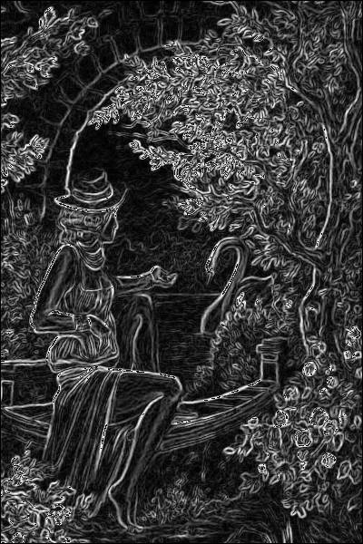{ width=100px }

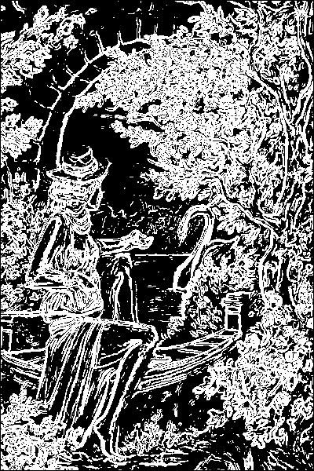{ width=100px }

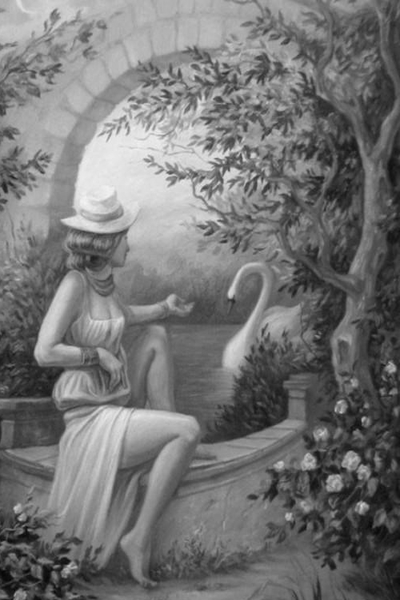{ width=100px }

#### Approach
1. Use Guassion filter \( H \) to perform low-pass filtering
$$
H =  
\frac{1}{9} *
\left[
    \begin{matrix}
        1 & 1 & 1 \\
        1 & 1 & 1 \\
        1 & 1 & 1
    \end{matrix}
\right]
$$

2. Use two matrix $G_r, G_c$ to compute $G$ for each pixels, obtaining the  gradient image (`result1.png`)
$$
G_r =  
\left[
    \begin{matrix}
        -1 & 0 & 1 \\
        -2 & 0 & 2 \\
        -1 & 0 & 1
    \end{matrix}
\right],
G_c =  
\left[
    \begin{matrix}
        1 & 2 & 1 \\
        0 & 0 & 0 \\
        -1 & -2 & -1
    \end{matrix}
\right]
$$
$$
G = \sqrt{G^2_R + G^2_R}
$$

1. Select the threshold to generate edge map. Here I choose pixel value > 95 in gradient image

#### Discussion
Here are images in different threshold:

  <figure>
    
    <figcaption style=" text-align: center">threshold = 95</figcaption>
  </figure>
  <figure>
    
    <figcaption style=" text-align: center">threshold = 50</figcaption>
  </figure>
  <figure>
    
    <figcaption style=" text-align: center">threshold = 120</figcaption>
  </figure>

It shows that if threshold is too small, the image will look dazzled. I tried different threshold, finding threshold = 95 obtain the best result, especially the texture of the woman's hand. If threshold is bigger than 95 (here I take 120 for example), some details will disappear.

### (b)

  <figure>
    
    <figcaption style=" text-align: center">sample1.png</figcaption>
  </figure>
  <figure>
    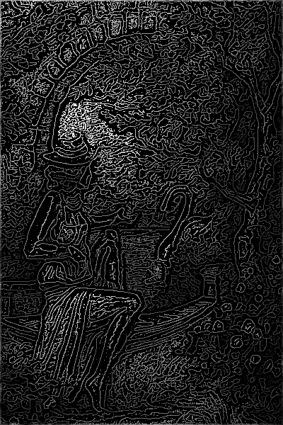
    <figcaption style=" text-align: center">result3.png</figcaption>
  </figure>

#### Approach
1. Use Guassion filter $H$ to perform low-pass filtering

2. Compute gradient magnitude and orientation

3. Do **non-maximal suppression**: For gradient of each pixels, check whether two neighbors along the orientation are both smaller than it. If so, verify it as a part of edge.

4. Label each pixels according to two threshold $T_H, T_L$, verify they are edge, candidate or non-edge pixels. Here I choose $T_H = 90, T_L = 10$

5. For each pixels that are verified with edge pixels, label its candidate neighbors with to be edges. Then label continuously with **dfs** method, obtaining the edge map (`result3.png`)

#### Discussion
Here are the images with different threshold $T_H, T_L$

  <figure>
    
    <figcaption style=" text-align: center">(10, 90)</figcaption>
  </figure>
  <figure>
    
    <figcaption style=" text-align: center">(10, 120)</figcaption>
  </figure>

  <figure>
    
    <figcaption style=" text-align: center">(5, 90)</figcaption>
  </figure>
  <figure>
    
    <figcaption style=" text-align: center">(30, 60)</figcaption>
  </figure>

I find that if $T_H$ is too high , some details will disappear (like woman's left leg). If $T_L$ is too low, the edge map show too much unimportant things. If we choose $T_L = 30, T_H = 90$, the image is pretty clear, but it lose some details. So I think (10, 90) is the most beautiful edge map after trying multiple thresholds

### (c)

  <figure>
    
    <figcaption style=" text-align: center">sample1.png</figcaption>
  </figure>
  <figure>
    
    <figcaption style=" text-align: center">result4.png</figcaption>
  </figure>

#### Approach

1. Use Guassion filter $H$ to perform low-pass filtering by two times

2. Use Laplacian filter $H'$ to enhence edge
$$
H' =  
\frac{1}{4} *
\left[
    \begin{matrix}
        0 & -1 & 0 \\
        -1 & 4 & -1 \\
        0 & -1 & 0
    \end{matrix}
\right]
$$

3. Generate the histogram to choose the threshold.

  <figure>
    
    <figcaption style=" text-align: center">Histogram after doing Laplacian filter</figcaption>
  </figure>

4. Choose a threshold to separate zero and non-zero. Here I choose threshold = 0.8

5. For each pixels that value = 0, check whether there are two oppsite neighbors being one postive and one negative. If so, verify it as an edge. Obtain the edge map (`result4.png`)

#### Disussion
Compare these three images:

  <figure>
    
    <figcaption style=" text-align: center">result2.png</figcaption>
  </figure>
  <figure>
    
    <figcaption style=" text-align: center">result3.png</figcaption>
  </figure>
  <figure>
    
    <figcaption style=" text-align: center">result4.png</figcaption>
  </figure>

1. I find that `result2.png` has thicker edges, and it can generate a good edge map with simple way.
2. It's surprising that canny method gereate such a beautiful image, `result3.png` has very clear lines, while retaining good details. The stone arched door can only be seen clearly in `result3.png` I think it's the most beautiful edge map of the three.
3. Take a look at these three images, `result4.png` seem to be the worst edge map. But compare to `result2.png` in detail, it generate the most import edge in the image. It rarely contains unnecessary lines after performing Guassian filter.

### (d)

  <figure>
    
    <figcaption style=" text-align: center">sample1.png</figcaption>
  </figure>
  <figure>
    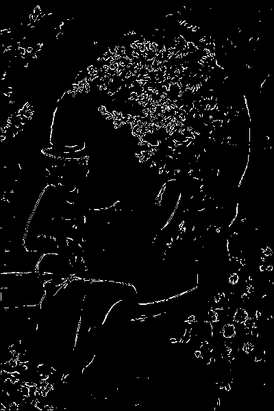
    <figcaption style=" text-align: center">portrait.png</figcaption>
  </figure>

  <figure>
    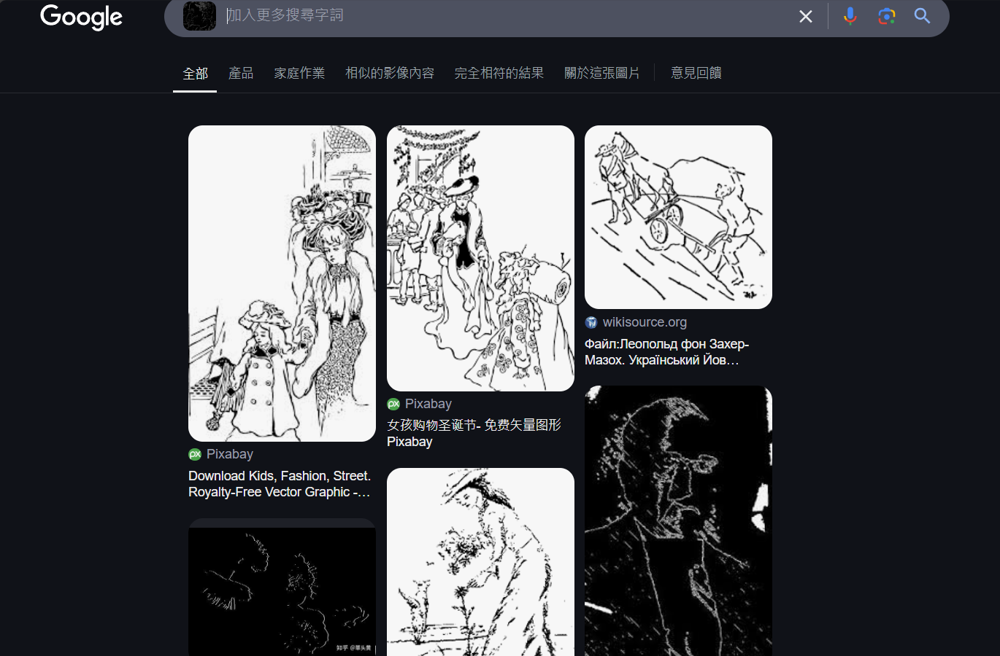
    <figcaption style=" text-align: center">sample1.png</figcaption>
  </figure>

#### Approach
1. I observe that Sobel method can easily show different edge map with different thresholds, so I choose to use it.
2. I tried threshold = 180 and 200, they both work. 

  <figure>
    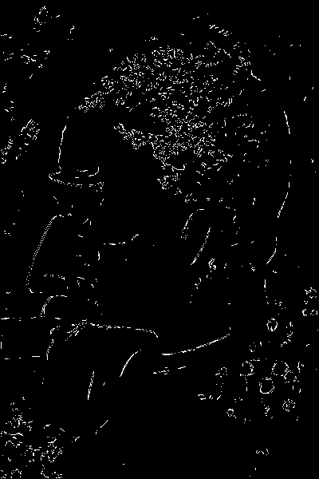
    <figcaption style=" text-align: center">threshold = 200</figcaption>
  </figure>
  <figure>
    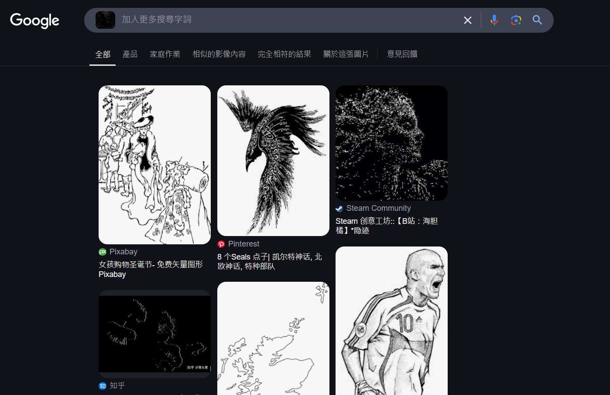
    <figcaption style=" text-align: center">search result with threshold = 200</figcaption>
  </figure>

### (e)

  <figure>
    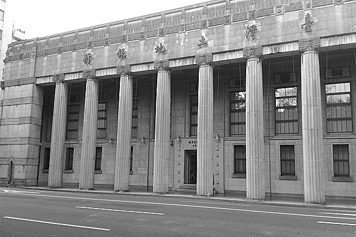
    <figcaption style=" text-align: center">sample2.png</figcaption>
  </figure>
  <figure>
    
    <figcaption style=" text-align: center">result5.png</figcaption>
  </figure>

  <figure>
    
    <figcaption style=" text-align: center">result6.png</figcaption>
  </figure>

  <figure>
    
    <figcaption style=" text-align: center">result7.png</figcaption>
  </figure>

#### Approach
1. First perform Canny edge detection by using $threshold_{low} = 60, threshold_{high} = 70$, obtaining `result5.png`
2. Apply hough transform to `result5.png` and obtain Hough space`result6.png`
3. Find the point that its slope is close to vertical line in `result6.png`, then we can count how many vertical line it has and count the number of pillars

## Problem 2: GEOMETRICAL MODIFICATION

### (a)

  <figure>
    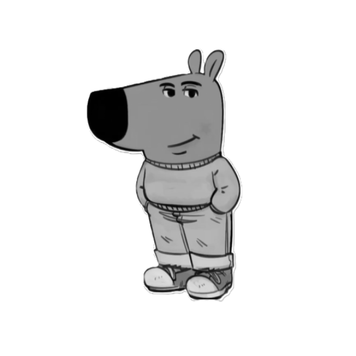
    <figcaption style=" text-align: center">sample3.png</figcaption>
  </figure>
  <figure>
    
    <figcaption style=" text-align: center">result8.png</figcaption>
  </figure>

#### Approach
1. Using barrel distortion formula by using backward treatment. Here I let $k_1 = 0.001, k_2 = 0$ 
$$
r_{new} = \sqrt{(x_{new} - x_{center})^2 + (y_{new} - y_{center})^2}
$$
And then
$$
r_{old} = r(1 + k_1r_{new}^2 + k_2r_{new}^4)
$$
We obtain $x_{old}, y_{old}$:
$$
x_{old} = x_{center} + (x_{new} - x_{center})\frac{r_{old}}{r_{new}}\\
y_{old} = y_{center} + (y_{new} - y_{center})\frac{r_{old}}{r_{new}}\\
$$
So, we obtain the image after barrel distortion

  <figure>
    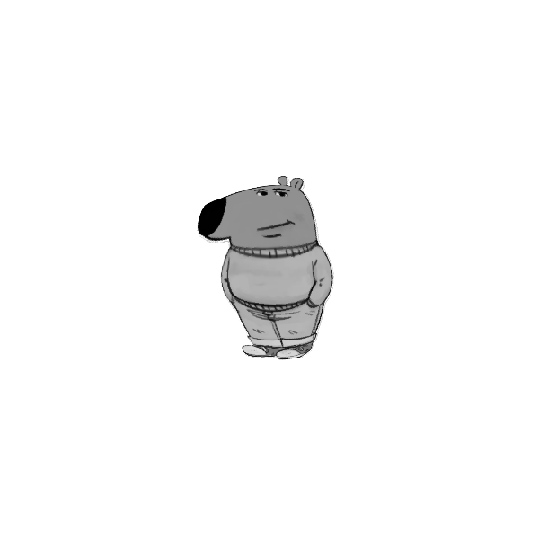
    <figcaption style=" text-align: center">Barrel distortion</figcaption>
  </figure>

2. Then I use multiple matrixes to control its scale, position and angle. Here I move left 70 pixels and up 60 pixels, rotate 15 degrees counterclockwise, and scale 2 times both of x and y. Finally, we obtain the result image.
$$  
\left[
    \begin{matrix}
        x_{new} \\
        y_{new} \\
        1
    \end{matrix}
\right]
= T^{-1}S^{-1}R^{-1}
\left[
    \begin{matrix}
        x_{old} \\
        y_{old} \\
        1
    \end{matrix}
\right]
$$
*Note: I always use the center of image to be the pivot*

### (b)

  <figure>
    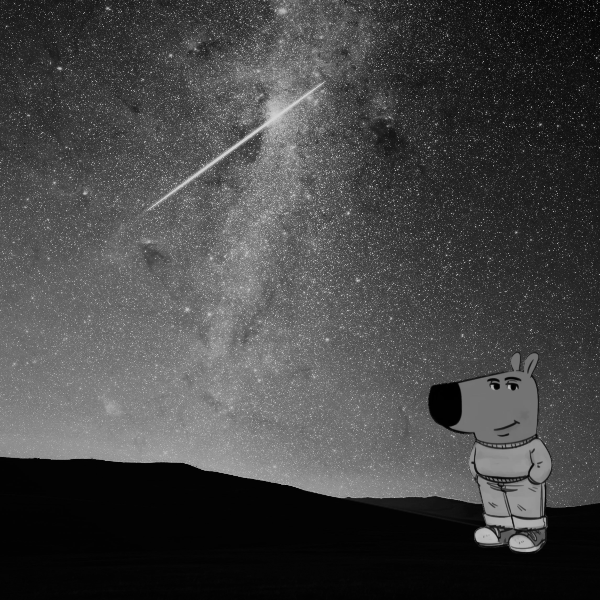
    <figcaption style=" text-align: center">sample5.png</figcaption>
  </figure>
  <figure>
    
    <figcaption style=" text-align: center">result9.png</figcaption>
  </figure>

#### Approach
Using swirling formula by using backward treatment.
Here I let $center=(200, 450), radius=300, strength=20, rotation=0$.
$$
\theta_{new} = \arctan(\frac{y_{new} - y_{center}}{x_{new} - x_{center}}) \\
\rho = \sqrt{(x_{new} - x_{center})^2 + (y_{new} - y_{center})^2}
$$
Then transform them according to
$$
r = \ln(2)\frac{radius}{5} \\
\phi = rotation \\
s = strength \\ 
\theta_{old} = \phi + se^{-\rho/r} + \theta
$$
Here we obtain original points angle and distance, so we can compute their positions
$$
x_{old} = x_{center} + \rho\cos(\theta_{old}) \\
y_{old} = y_{center} + \rho\cos(\theta_{old})
$$
Finally we obtain the new image through swirling.

#### Discussion
I think the most important part of this problem is **the center of the swirl**. `sample6.png` looks very smooth, and there is a perfect shape of its center. The arcs in `result9.png` look more clearly, but doesn't look such smooth as `sample6.png` overall. And I think it looks almost the same around the swirl.