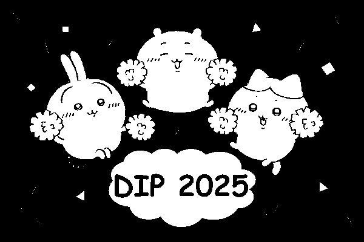
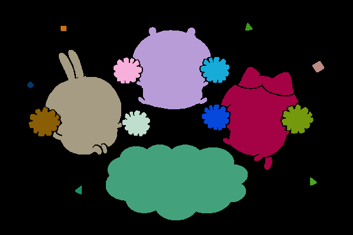
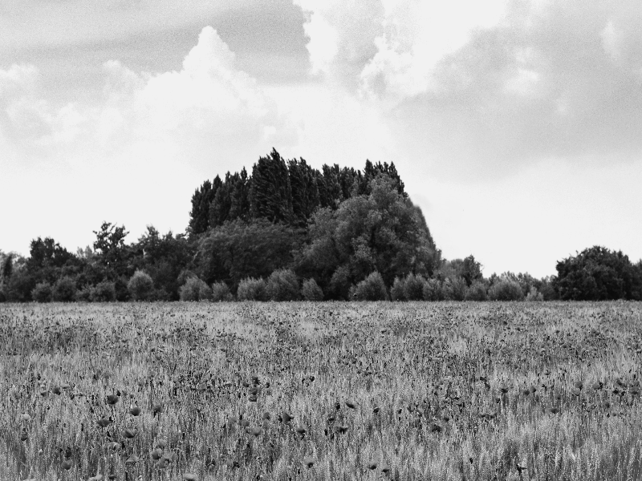
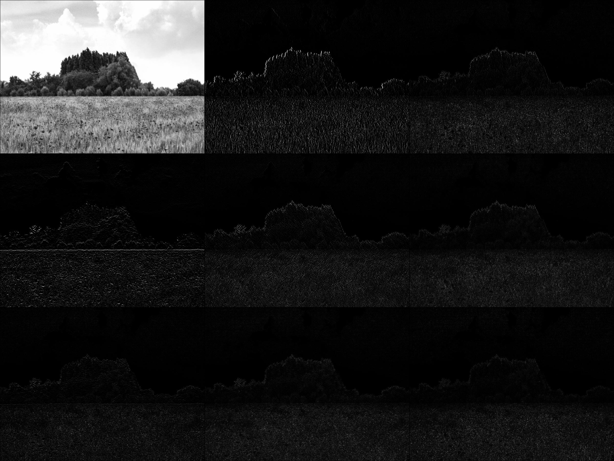

# DIP Homework Assignment #3

## Problem 1: MORPHOLOGICAL PROCESSING

### (a)

  <figure>
    
    <figcaption style=" text-align: center">sample1.png</figcaption>
  </figure>
  <figure>
    
    <figcaption style=" text-align: center">result2.png</figcaption>
  </figure>

#### Approach
I use minmax denoise method with window size = 5

### Discussion
The noises in `sample1.png` looks like salt noises, so I choose impluse denoise method to deal with it.
I also find that it can not use maxmin method, because it the value of maxmin are also noises. Below is the result of maxmin method with window size = 5:

  <figure>
    
    <figcaption style=" text-align: center">maxmin with window size = 5</figcaption>
  </figure>

### (b)

  <figure>
    
    <figcaption style=" text-align: center">result1.png</figcaption>
  </figure>
  <figure>
    
    <figcaption style=" text-align: center">result2.png</figcaption>
  </figure>

#### Approach
1. Fill the background with white by using **dfs**.

  <figure>
    
    <figcaption style=" text-align: center">result2-1.png</figcaption>
  </figure>

2. Inverte the image to `result2-1.png` (perform bitNOT).

  <figure>
    
    <figcaption style=" text-align: center">result2-1.png</figcaption>
  </figure>

3. Perform bitOR to `result2.png` and `result2-2.png`, Obtaining the image with hole filling.

#### Discussion
I find it is important that we should use a good way to denoise `result1.png`. If we do not perform a good denoise method, like `5` in `2025` will connect to the outer black background, then we will get bad result (`5` will not be filled with white color correctly).

### (c)

  <figure>
    
    <figcaption style=" text-align: center">result1.png</figcaption>
  </figure>
  <figure>
    
    <figcaption style=" text-align: center">result3.png</figcaption>
  </figure>

#### Approach
1. For each 3 by 3 grid in the image $F$, compute its bond, then compare whether it is one of skeletonzation conditional patterns. If so, mark it on the mark image $G$.
2. Then for each 3 by 3 grid in the mark image $G$, check whether it hit skeletonization unconditional patterns or not. If hit, do nothing. Otherwise, erose it on $F$, he image is saved as $F'$.
3. Let $F'$ as new $F$ in step 1, iterate step 1 to step 3 about 35 times in `result1`, obtaining `result3.png`.

#### Discussion
It is very slow if we check unconditional patterns one by one in step 2, so I use the same way in step 1. First compute each grid's bond (the mark pixel is consider logical True). Then according to its bond, find the patterns it should compared. This method can faster the speed of this problem.
The result looks very strange, I could not image the result before obtaining it. The approach is easy to get wrong because we should carefully copy all patterns.

### (d)
Count result: 16

  <figure>
    
    <figcaption style=" text-align: center">result2.png</figcaption>
  </figure>
  <figure>
    
    <figcaption style=" text-align: center">Same Object with the same color</figcaption>
  </figure>

#### Approach
I use the image with hole filling `result2.img`
1. Find connected component using dilation method. From left to right, from top to bottom, find the first unlabeled white pixel.
2. Use this pixel as start point, give this pixel a label value.Then approach 8-connectedness mask to all its neighbor, label all its neighbor to the label value if it is white in original image. Repeat until these pixels can't find any white neighbors.
3. Repeat step 1 and step 2, we can label all points and classify all connected components.
4. After the above approach, we can count there are 18 objects, but we want to count tail and head to the same object.
5. Check every connected components' border. If any two different connected components have overlap in vertical, and one of two covers another in horizontal, these two objects should be seem as the same object.
6. From the above approach, we can count there are 16 objects finally

#### Discussion
I find that if we want to find connected component, we can also use **dfs** method, this is more simple to implement. But using dilation is more general to other cases, it's the interesting method!
In this image, I think the steps before step 4 is general case. But if we want to verify some differents objects to the same object, we must additionally add some diciders to determine that. But in other cases, we have to use other principle or some more general diciders to determine same objects.

## Problem 2: TEXTURE ANALYSIS

### (a)

  <figure>
    
    <figcaption style=" text-align: center">sample2.png</figcaption>
  </figure>
  <figure>
    
    <figcaption style=" text-align: center">sample2 with different Laws</figcaption>
  </figure>

#### Approach
Use Laws in slides to generate 9-dimension vector for each pixel

#### Discussion
1. Laws 1 is low-pass filter we haved learned, so the brightness are closed to `sample2.png`.
2. Laws 2 and Laws 4 are high-pass filter with vertical and horizontal line that we haved learn, too. We can observe that Laws 2 only show areas that are obvious vertical line in `sample2.png`. The same, Laws 4 only show areas that are obvious horizontal line in `sample.png`.
3. Other Laws are almost dark even if I haved already normalized to 255, maybe it contains the information that human's eyes can't observe.

### (b)

  <figure>
    
    <figcaption style=" text-align: center">sample2.png</figcaption>
  </figure>
  <figure>
    
    <figcaption style=" text-align: center">result4.png</figcaption>
  </figure>

#### Approach
1. Prepare 9-dimension vectors for all $N*M$ pixels.
2. Random select k centroids in these pixel vectors. Here I choose $k=3$
3. For each pixel, compute its vector's distance (Euclidean distance) to all centroids, classify which one it belongs to with shortest distance.
4. After classifying all pixels, compute its new centroids by vectors' **mean** in each class.
5. Compare the sum of distances of old centroids and new centroids. If it is smaller than a threshold (converge), the classification finished. Otherwise, update centroids to new centroids and repeat step 2 to step 5.
6. When finding converge centroids, label different color to each cluster.

#### Discussion
I find it may not converge even if it runs over 100 times, so I limit the maximum iteration counts to 50 to avoid infinite loop.
The result shows that I can't absolutely classify the mountain and grass. I find it depends on the random choice in step 1. I guess if I could select good centroids in the begining, the result might be better.

### (c)

  <figure>
    
    <figcaption style=" text-align: center">result4.png</figcaption>
  </figure>
  <figure>
    
    <figcaption style=" text-align: center">result5.png</figcaption>
  </figure>

#### Approach
1. Find different texture patterns online
2. Add texture to each region by finding what color the pixels in pattern are.

#### Discussion
I used the method:
1. Generate a new image with the same size as the origin to be a texture pattern.
2. For each pixel (r, c) in origin image, classify which class it is, find corresponding color of the pixel (r, c) in the pattern.

I learned that it is easy to add texture to objects. But maybe this approach is not feasible because of different size.

It seems the border of different class were successfully been seperated with different texture. And it seems the part of grass contains lot of noise because the classification is poor in result4. 