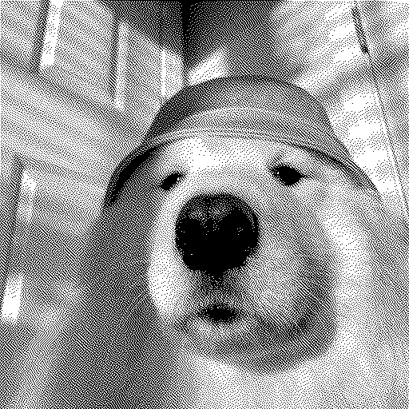
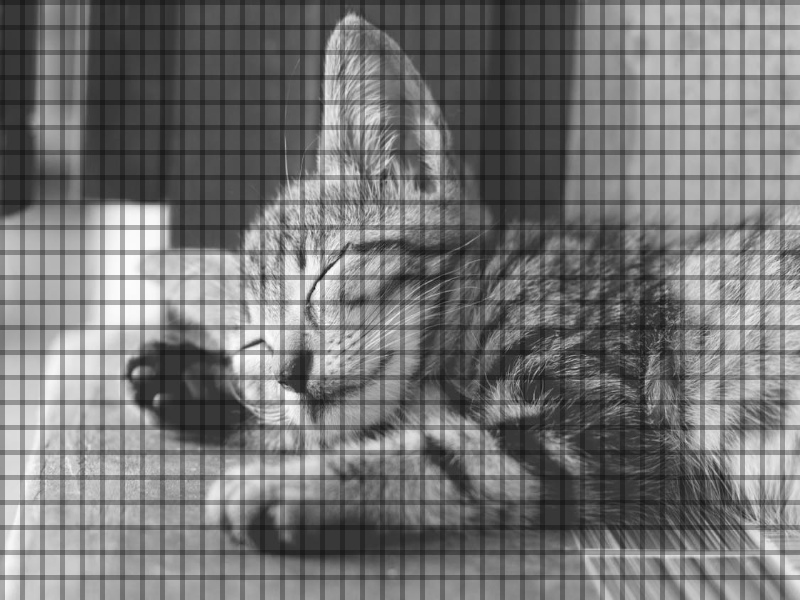
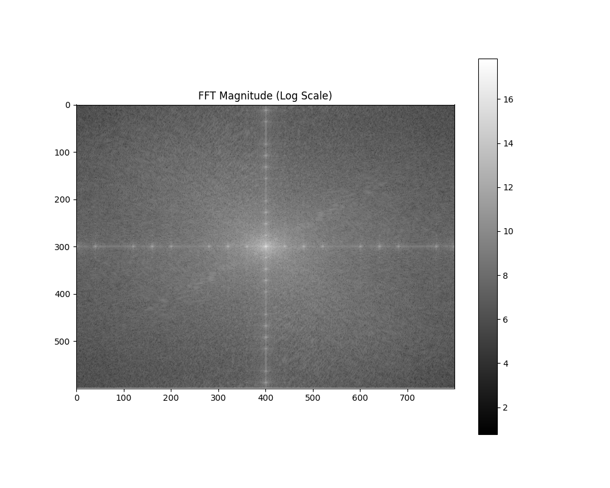
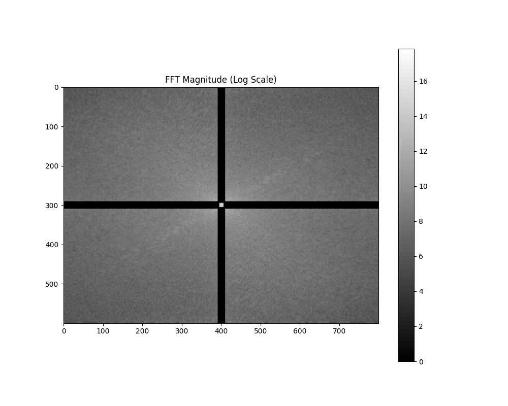

# DIP Homework Assignment #3

## Problem 1: DIGITAL HALFTONING

### (a)

  <figure>
    
    <figcaption style=" text-align: center">sample1.png</figcaption>
  </figure>
  <figure>
    
    <figcaption style=" text-align: center">result1.png</figcaption>
  </figure>

#### Approach
1. Convert the dithering matrix to pixel value by using formula:
$$
T_{r, c} = 255*\frac{Dither_{r, c}+0.5}{N^2}
$$
1. For each 2*2 square area $H_{2*2}$, check whether $H_{r, c}$ is bigger than $T_{r, c}$. If so, assign that pixel to 255. Otherwise, assign it to 0.

### (b)

  <figure>
    
    <figcaption style=" text-align: center">sample1.png</figcaption>
  </figure>
  <figure>
    
    <figcaption style=" text-align: center">result2.png</figcaption>
  </figure>

#### Approach
1. Double the size of 2\*2 dithering matrix 7 times. the dithering matrix will become 256\*256 matrix
2. For each 256\*256 square area $H_{256*256}$, check whether $H_{r, c}$ is bigger than $T_{r, c}$. If so, assign that pixel to 255. Otherwise, assign it to 0.

#### Discussion

  <figure>
    
    <figcaption style=" text-align: center">result1.png</figcaption>
  </figure>
  <figure>
    
    <figcaption style=" text-align: center">result2.png</figcaption>
  </figure>

1. The white areas in `result1.png` contain only white pixel, but still contain many black pixel in `result2.png` 
2. `result2.png` is closer to the view of human eyes see. It looks have more colors in `result2.png`,  but looks only few color in `result1.png`

### (c)

  <figure>
    
    <figcaption style=" text-align: center">sample1.png</figcaption>
  </figure>
  <figure>
    
    <figcaption style=" text-align: center">result3.png</figcaption>
  </figure>
  <figure>
    
    <figcaption style=" text-align: center">result4.png</figcaption>
  </figure>

#### Approach
1. For each pixel from left to right, from top to buttom, check whether it is greater than 127. If so, set this pixel to 255, or set it to 0. Diffuse the difference between pixel value and 255 (or 0) to its neighbors according to the diffusion matrix.

#### Discussion

  <figure>
    
    <figcaption style=" text-align: center">Floyd-Steinberg dithering</figcaption>
  </figure>
  <figure>
    
    <figcaption style=" text-align: center">Jarvis-Judice-Ninke dithering</figcaption>
  </figure>
  <figure>
    
    <figcaption style=" text-align: center">Stucki dithering</figcaption>
  </figure>

  <figure>
    
    <figcaption style=" text-align: center">Atkinson dithering</figcaption>
  </figure>
  <figure>
    
    <figcaption style=" text-align: center">Burkes dithering</figcaption>
  </figure>

1. Floyd-Steinberg dithering has more vertical lines than others.
2. Stucki dithering has lots of lefttop-rightbuttom and righttop-leftbuttom lines.
3. Floyd-Steinberg dithering and Atkinson dithering have more single dot than others.
4. Burkes dithering has deeper profile than others, and it look smoother than others.
5. Atkinson dithering looks brighter than others, and it perform perfectly in the brighter areas.

## Problem 2: SHAPE ANALYSIS

#### Approach
1. Use threshold to convert to binary image. Here I use $threshold = 180$
2. Remove stave (5 long horizontal lines) by checking black ratio in rows. If it over 50%, it means there is staff in this row. Keep the notes by checking whether $P_{r+1,c}$ or $P_{r-1,c}$ is black or not. Here is the result after removing the staff:

  <figure>
    
    <figcaption style=" text-align: center">Remove stave in sample2</figcaption>
  </figure>

  <figure>
    
    <figcaption style=" text-align: center">Remove stave in sample3</figcaption>
  </figure>

3. Use connected component to label notes from left to right. Remember there are noises here (including bar lines and final double bar lines).
4. Use training set to pre-compute each notes' shape $\frac{height}{width}$ ratio.
5. Verify each notes' shape ratio, and check holes to determine Half sotes and Quarter Notes. Then check notes' picth by checking where the bottom of the notes are. The above process can remove bar line and end double bar lines. We can obtain the final result.
**Sample2: 1, 2(C), 2(C), 2(G), 2(G), 2(A), 2(A), 4(G), 2(F), 2(F), 2(E), 2(E), 2(D), 2(D), 4(C)**
**Sample3: 1, 2(G), 3(A), 2(G), 3(F), 2(E), 2(F), 2(G), 2(D), 13, 2(G), 2(E), 2(D), 2(C)**

#### Discussion
1. I find that even if I don't remove the horizontal line of the notes in pitch $C$, I can still verify different notes by using shape.

## Problem 3: FREQUENCY DOMAIN

  <figure>
    
    <figcaption style=" text-align: center">sample4.png</figcaption>
  </figure>
  <figure>
    
    <figcaption style=" text-align: center">result5.png</figcaption>
  </figure>

  <figure>
    
    <figcaption style=" text-align: center">result6.png</figcaption>
  </figure>
  <figure>
    
    <figcaption style=" text-align: center">result7.png</figcaption>
  </figure>

#### Approach
1. Use FFT to transform to frequency domain, then shift zero frequency to center. Here is the frequency domain of `sample4.png`:

  <figure>
    
  </figure>

2. We observe that there are two bright lines, one is vertical bright line, another is horizontal bright line. It represent the horizontal lines and vertical lines in image. So I use a mask to remove the bright lines. Here is the result of the frequency domain by removing bright line within 5 pixels (Preserve center bright point):

  <figure>
    
  </figure>
  <figure>
    
  </figure>
  <figure>
    
  </figure>

3. Use inverse shift and inverse FFT to restore to image.

#### Discussion
1. I find that it is necessary to keep the bright point in the center, or the image will become very dark.
2. It seems there is no lines after fft. But when I zoom in the image, there are still lines in result image.
3. The image will be blurred after fft, especially the image after removing horizontal and vertical lines.